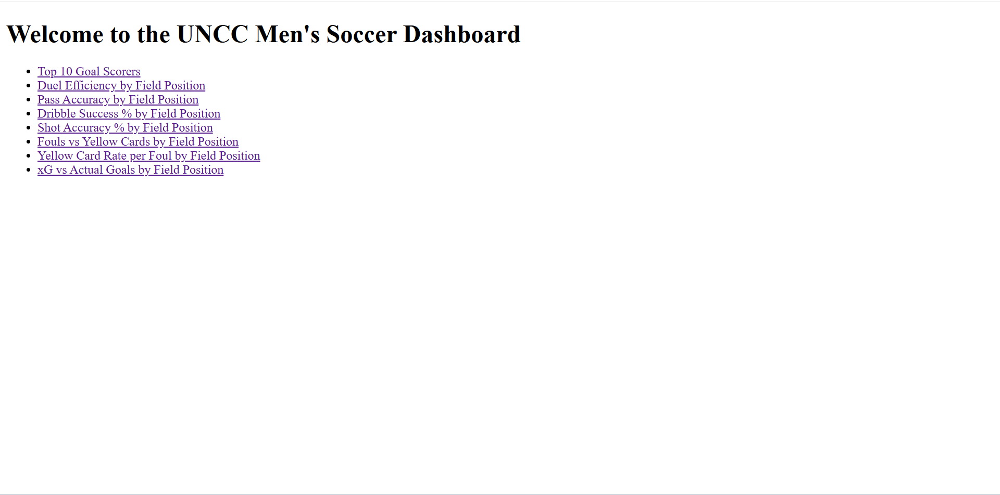

# UNCC MSOC 2023 – Sports Analytics Dashboard (Flask)

This is a sports analytics dashboard created using **Flask** in **Python** for the **2023 UNC Charlotte Men's Soccer Team**. It visualizes player and team performance metrics using interactive charts and tables. The data comes from Excel and CSV files, and the interface is built with HTML templates.

---

## 📁 Project Structure

```
UNCC MSOC 2023/
│
├── templates/                 # HTML files for the dashboard views
│   ├── dashboard.html
│   └── home.html
│
├── MSOC_project 1.ipynb       # Jupyter Notebook containing Flask code
├── dashboard.py               # Python script version of the Flask app
├── UNCC MSOC 2023.csv         # CSV-formatted match or player data
├── UNCC MSOC 2023.xlsx        # Excel version of the same or additional data
├── screenshot.png             # Dashboard screenshot image
├── requirements.txt           # Python dependencies
└── README.md                  # This file (describes the project)
```

---

## 🛠️ How to Run This Project

### Requirements

This project requires:

- Python 3.10 or higher
- Flask
- pandas
- openpyxl

(Optional but recommended): use a virtual environment to manage dependencies.

---

### Setup Instructions

Open a terminal or command prompt and navigate to the project folder:

```bash
cd "C:\Users\jelli\OneDrive\Desktop\Personal Projects\UNCC MSOC 2023"
```

(Optional) Create and activate a virtual environment:

```bash
python -m venv venv
venv\Scripts\activate
```

Install the required Python packages using the included requirements file:

```bash
pip install -r requirements.txt
```

If you don’t have a requirements file, install packages manually:

```bash
pip install flask pandas openpyxl
```

Run the Flask application:

```bash
python dashboard.py
```

Then open your browser and go to:

[http://127.0.0.1:5000](http://127.0.0.1:5000)

---

## 📸 Dashboard Screenshot



---

## 📦 Sample Output

This dashboard displays:

- Player comparisons such as expected goals (xG) vs. actual goals
- Match-by-match team metrics
- Interactive bar charts grouped by player position or game date

---

## 🧩 Customization

To adapt this dashboard for another team or season:

- Replace `UNCC MSOC 2023.csv` and `UNCC MSOC 2023.xlsx` with new files
- Maintain the same structure and column names where possible
- Modify the Flask logic or HTML templates if your data format changes

---

## 🙋 Author

**Jameson Ellis**  
M.S. in Data Science and Business Analytics  
University of North Carolina at Charlotte


